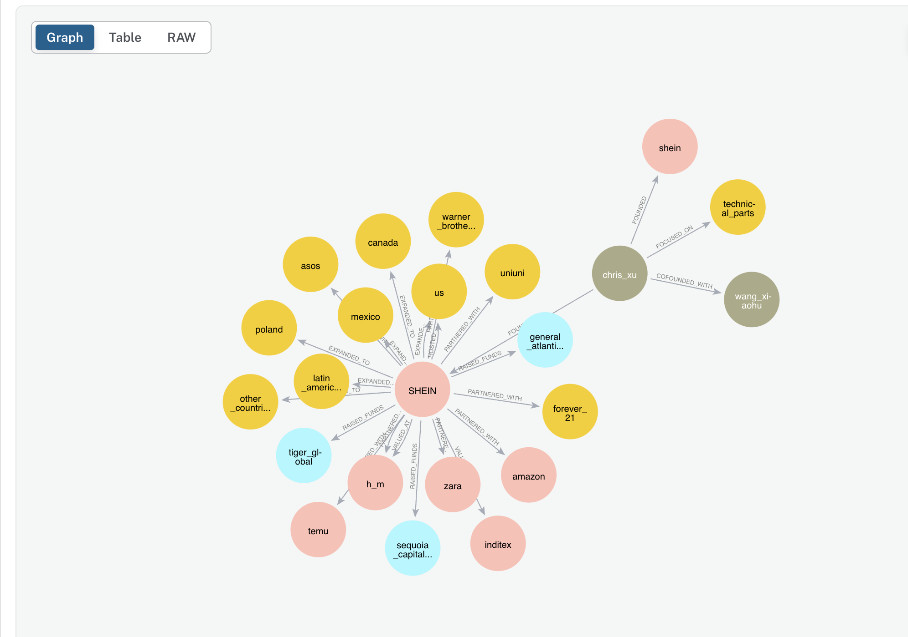

# Project Articles Visualization

This project is for extracting keywords and relationships from articles, and creating knowledge graph for visualization. The core components include **data extraction**, **disambiguation**, and **Creating a Knowledge Graph from Unstructured Data with Neo4j**, enabling efficient handling of unstructured data such as txt files.

## Repository Structure

- **main**: Entity and Relationship extraction and  disambiguation are under components folder, The main_viz file is under src folder. 

- **dataset**: txt files


## Running the Demos

- Ensure your Neo4j instance is running and accessible.
- Update the file_path variable in the script to point to your input text file.
- Run the script: python main_viz.py


```
URI: neo4j+s://demo.neo4jlabs.com
username: (own username)
password: (own password)
```




## Note
Thank you for your interest in our project. We hope you find this repository useful and informative.