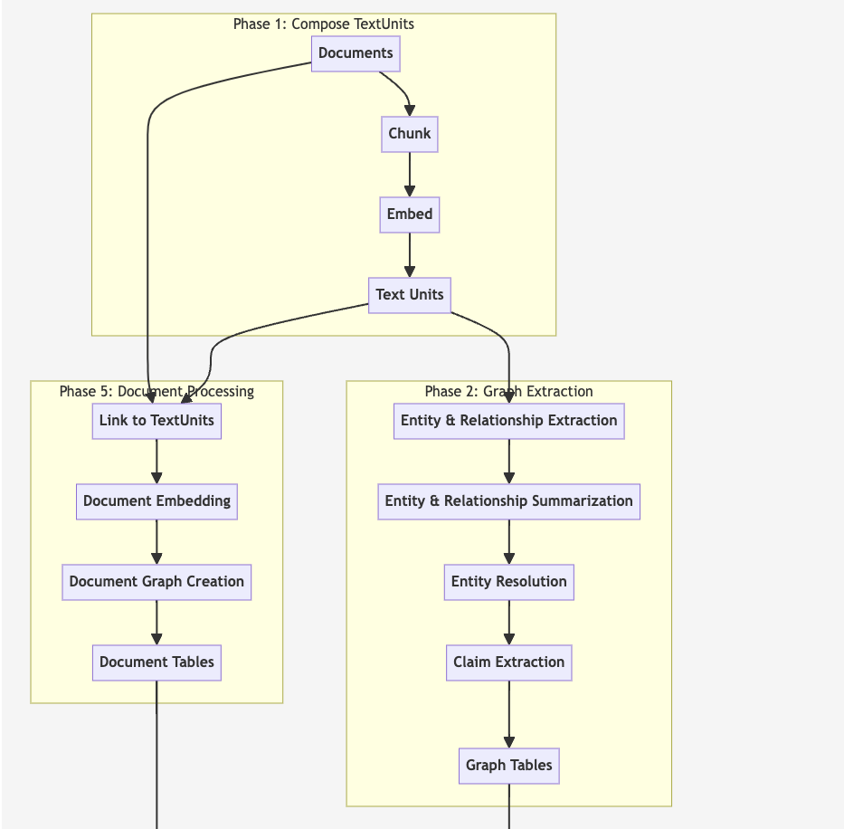

# GraphRAG

👉 [Use the GraphRAG Accelerator solution](https://github.com/Azure-Samples/graphrag-accelerator)  
👉 [Microsoft Research Blog Post](https://www.microsoft.com/en-us/research/blog/graphrag-unlocking-llm-discovery-on-narrative-private-data/) 
👉 [Read the docs](https://microsoft.github.io/graphrag) 
👉 [GraphRAG Arxiv](https://arxiv.org/pdf/2404.16130)

  
  
  
  

## Overview

The GraphRAG visualization project include two phases: graphrag and visualization. 

To learn more about GraphRAG and how it can be used to enhance your LLMs ability to reason about your private data, please visit the <a href="https://www.microsoft.com/en-us/research/blog/graphrag-unlocking-llm-discovery-on-narrative-private-data/" target="_blank">Microsoft Research Blog Post.</a>

For knowledge graph visualization, the entities information are extracted from Phase 2, Graph Tables. 

The demo folder include results of running multiple text files(mutitxt) and one single file(ragtest)

## Quickstart
Step1 : Extracting entities and connections, please visit the <a href= "https://microsoft.github.io/graphrag/posts/get_started/">How to run.</a>

Step 2: Visualization 
1. update file (output) path
2. feature examples: 
 * [Pause / Resume animation]： rotate_test.ipynb
 * [Text as nodes]

Reference: <a href="https://github.com/vasturiano/3d-force-graph">3d-force-graph</a>
## Prompt Tuning

Using _GraphRAG_ with your data out of the box may not yield the best possible results.
We strongly recommend to fine-tune your prompts following the [Prompt Tuning Guide](https://microsoft.github.io/graphrag/posts/prompt_tuning/overview/) in our documentation.

## Responsible AI FAQ

See [RAI_TRANSPARENCY.md](./RAI_TRANSPARENCY.md)

- [What is GraphRAG?](./RAI_TRANSPARENCY.md#what-is-graphrag)
- [What can GraphRAG do?](./RAI_TRANSPARENCY.md#what-can-graphrag-do)
- [What are GraphRAG’s intended use(s)?](./RAI_TRANSPARENCY.md#what-are-graphrags-intended-uses)
- [How was GraphRAG evaluated? What metrics are used to measure performance?](./RAI_TRANSPARENCY.md#how-was-graphrag-evaluated-what-metrics-are-used-to-measure-performance)
- [What are the limitations of GraphRAG? How can users minimize the impact of GraphRAG’s limitations when using the system?](./RAI_TRANSPARENCY.md#what-are-the-limitations-of-graphrag-how-can-users-minimize-the-impact-of-graphrags-limitations-when-using-the-system)
- [What operational factors and settings allow for effective and responsible use of GraphRAG?](./RAI_TRANSPARENCY.md#what-operational-factors-and-settings-allow-for-effective-and-responsible-use-of-graphrag)

## Trademarks

This project may contain trademarks or logos for projects, products, or services. Authorized use of Microsoft
trademarks or logos is subject to and must follow
[Microsoft's Trademark & Brand Guidelines](https://www.microsoft.com/en-us/legal/intellectualproperty/trademarks/usage/general).
Use of Microsoft trademarks or logos in modified versions of this project must not cause confusion or imply Microsoft sponsorship.
Any use of third-party trademarks or logos are subject to those third-party's policies.

## Privacy

[Microsoft Privacy Statement](https://privacy.microsoft.com/en-us/privacystatement)
