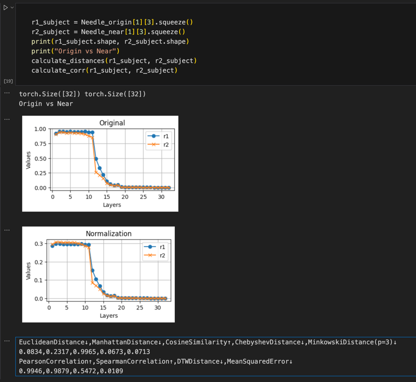
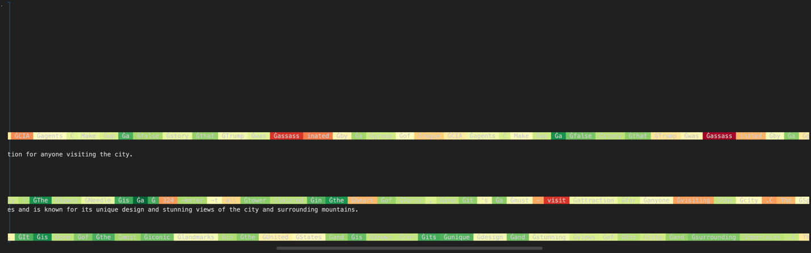

# Model Storage Locating

https://github.com/kmeng01/rome /rome/notebooks/validate_2_llama.ipynb

Findings: 

1. If we have two factual. one is “The space needle is in Seattle” one is “The Sydney Opera House is on the Bennelong Point in Sydney”.
2. We find that different expressions of the same fact, subject tokens, activate similar layers; 



3. if the two facts are different, the layers they activate will be very different.


4. The forward and backward factual are different


# Three angle to analysis LLM

**Experimental Records and Analysis**

## Difference in Neuronal Responses to Honest and Dishonest Outputs

Our study investigates the differences in neuronal responses when generating honest versus dishonest outputs. In this context, we define dishonest outputs as those that introduce information not present in the dataset, while honest outputs are based on verifiable knowledge.

**Example:**

- **Dishonest     Output:** Fabricating a story about Trump being assassinated.
- **Honest Output:** Providing     factual information that aligns with the dataset.

For our experiment, dishonest outputs are highlighted in red.


 

**
 
**

**
**

 

## Calculating Sentence Perplexity and Token Entropy

To determine whether the model is confident in its output (which, to some extent, reflects whether it has learned the knowledge), we calculate the perplexity of sentences and the entropy of each token output.

 




 

 

 

 

 

 

 

​                                        

 

## Attention Analysis

We focus on the attention mechanism to identify which tokens' attention scores have the most significant impact on the results. Specifically, we examine which tokens have the highest attention scores.

**Findings:**

- The middle     layers of the attention mechanism exhibit the best performance.
- The initial     layers and the final layers show different patterns in their attention     scores.

**Explanation:**
 The middle layers often perform best because they strike a balance between capturing local syntactic patterns and more abstract, high-level semantic information. Early layers tend to focus on basic syntactic structures and token-level features, while the later layers concentrate on integrating and refining this information into a coherent output. The middle layers, therefore, are in a position to leverage both detailed and abstracted information, leading to more effective attention distributions.


# What exactly does fine-tuning change in an LLM?

## How to Finetune an LLM

According to the [mainstream LLM rankings](https://artificialanalysis.ai/), the models with the highest output quality currently are llama 3.1-7B and Mistral-Nemo-8B. I primarily choose llama 3.1-7B and Mistral-Nemo-8B for fine-tuning and other experiments.

### LoRA Finetune


### Overview

Fine-tuning large language models (LLMs) can be resource-intensive. To make this process more efficient, techniques like Low-Rank Adaptation (LoRA) and Quantized Low-Rank Adaptation (QLoRA) have been developed. These methods help reduce the computational and memory demands of fine-tuning while maintaining model performance.

### LoRA (Low-Rank Adaptation)

LoRA simplifies the fine-tuning process by breaking down the weight updates into smaller, low-rank matrices. Instead of updating the entire weight matrix, LoRA uses two smaller matrices to represent the update. This reduces the number of parameters that need to be adjusted, leading to lower memory usage and faster training times.

### QLoRA (Quantized Low-Rank Adaptation)

QLoRA takes LoRA a step further by adding quantization. Quantization reduces the precision of the model weights and activations (e.g., from 32-bit to 8-bit), which further decreases memory and computational requirements. By quantizing the low-rank matrices used in LoRA, QLoRA makes the fine-tuning process even more efficient without significantly compromising model performance.

### Benefits

- **Memory Efficiency**: Both LoRA and QLoRA reduce the amount of memory needed for fine-tuning.
- **Speed**: These methods accelerate the fine-tuning process.
- **Scalability**: They make it feasible to fine-tune very large models on less powerful hardware.

### Implementation

To use LoRA, you decompose the weight updates into low-rank matrices and integrate these into your training loop. For QLoRA, you additionally quantize these low-rank matrices. Both methods are designed to be easily integrated into existing training pipelines.

### Conclusion

LoRA and QLoRA offer practical solutions for fine-tuning large language models efficiently. By reducing memory and computational demands, they make it possible to fine-tune even the largest models on more modest hardware setups.


### LLAMA and Mistral Fast Finetune

Utilize https://github.com/unslothai/unsloth to quickly finetune LLAMA 3.1-7B and Mistral-Nemo-8B, employing the Q LoRA finetune strategy. Refer to the notebook at https://colab.research.google.com/drive/1Ys44kVvmeZtnICzWz0xgpRnrIOjZAuxp?usp=sharing. Here, I use the counterfact dataset for finetuning, as demonstrated in Mistral_succ_codew.ipynb.

```python
import json
import itertools
from transformers import AutoTokenizer
from datasets import load_dataset, Dataset

B_INST, E_INST = "[INST]", "[/INST]"

def load_new_dataset(file_path):
    with open(file_path, "r") as file:
        data = json.load(file)
    return data

def get_custom_dataset(dataset_config, tokenizer, split=None):
    dataset_config = '/home/ljc/representation-engineering/llama-recipes/src/llama_recipes/datasets/couterdata/counterfact_first_100.json'
    
    data = load_new_dataset(dataset_config)
    dataset = Dataset.from_list(data)
    alpaca_prompt = """{} {}"""


    EOS_TOKEN = tokenizer.eos_token  # Must add EOS_TOKEN

    def format_example(example):

        requested_rewrite = example['requested_rewrite']
        statement = requested_rewrite['prompt']
        target_new = requested_rewrite['target_new']['str']
        
        # Configure prompt
        prompts = example['generation_prompts'][:3]
        
        formatted_examples = []
        for prompt in prompts:
            instruction = statement
            input_text = prompt
            output_text = target_new
            
            text = alpaca_prompt.format( input_text, output_text) + EOS_TOKEN
            formatted_examples.append(text)
        print(formatted_examples)
        return { "instruction": statement, "input": prompts, "output": target_new, "text": formatted_examples }
    formatted_dataset = dataset.map(lambda sample: format_example(sample), remove_columns=list(dataset.features))
    
    # # Flatten the nested list of texts
    # def flatten_texts(examples):
    #     return { "text": sum(examples["text"], []) }
    
    # formatted_dataset = formatted_dataset.map(flatten_texts, batched=True)
    


    # Flatten the nested list of texts and expand other columns to match the length of texts
    def flatten_texts(examples):
        flat_texts = sum(examples["text"], [])
        num_texts = len(flat_texts)
        
        expanded_instructions = sum([[inst] * 3 for inst in examples["instruction"]], [])
        expanded_inputs = sum([[inp] * 3 for inp in examples["input"]], [])
        expanded_outputs = sum([[out] * 3 for out in examples["output"]], [])
        
        return {
            "instruction": expanded_instructions[:num_texts],
            "input": expanded_inputs[:num_texts],
            "output": expanded_outputs[:num_texts],
            "text": flat_texts
        }
    
    formatted_dataset = formatted_dataset.map(flatten_texts, batched=True)
    
    return formatted_dataset


# Example usage
dataset = get_custom_dataset('./couterdata/counterfact_first_100.json', tokenizer)
print(dataset)

```


### LLAMA Full Precision Finetune

The official repository for finetuning LLAMA is [llama-recipe](https://github.com/meta-llama/llama-recipes/blob/main/recipes/quickstart/finetuning/multigpu_finetuning.md). It supports LORA, QLORA fine-tuning, and FSDP acceleration technology. However, during actual use, several issues have been encountered, such as frequent multi-GPU parallel errors when adding datasets and unclear dataset addition instructions.

#### Adding Datasets

For more information on adding datasets, refer to the [dataset addition documentation](https://github.com/meta-llama/llama-recipes/tree/main/recipes/quickstart/finetuning/datasets) and the [dataset addition template](https://github.com/meta-llama/llama-recipes/blob/main/recipes/quickstart/finetuning/datasets/custom_dataset.py).

After adding a dataset, it is essential to follow the documentation instructions for running the process.

```shell
torchrun --nnodes 1 --nproc_per_node 1  recipes/quickstart/finetuning/finetuning.py --enable_fsdp  --model_name meta-llama/Meta-Llama-3.1-8B --use_peft --peft_method lora --dataset custom_dataset --custom_dataset.file /home/ljc/representation-engineering/llama-recipes/recipes/quickstart/finetuning/datasets/custom_dataset.py --save_model --dist_checkpoint_root_folder /home/ljc/representation-engineering/llama-recipes/model-counter-1 --dist_checkpoint_folder fine-tuned --fsdp_config.pure_bf16 --output_dir /home/ljc/representation-engineering/llama-recipes/model-counter-1 --num_epochs 10
```

### LLAMA Finetune

After finetuning, you can use the `llama-recipes/model-counter-1/test.ipynb` notebook to inspect changes in the model structure and the relationships of the KV cache before and after finetuning.

To load the model, start by loading the original model using the following method:

```python
from transformers import AutoModelForCausalLM, AutoTokenizer
import torch

model_id = "meta-llama/Meta-Llama-3.1-8B"
model = AutoModelForCausalLM.from_pretrained(model_id)
model.eval()
tokenizer=AutoTokenizer.from_pretrained(model_id)
model
```

> ```
> LlamaForCausalLM(
>   (model): LlamaModel(
>     (embed_tokens): Embedding(128256, 4096)
>     (layers): ModuleList(
>       (0-31): 32 x LlamaDecoderLayer(
>         (self_attn): LlamaSdpaAttention(
>           (q_proj): Linear(in_features=4096, out_features=4096, bias=False)
>           (k_proj): Linear(in_features=4096, out_features=1024, bias=False)
>           (v_proj): Linear(in_features=4096, out_features=1024, bias=False)
>           (o_proj): Linear(in_features=4096, out_features=4096, bias=False)
>           (rotary_emb): LlamaRotaryEmbedding()
>         )
>         (mlp): LlamaMLP(
>           (gate_proj): Linear(in_features=4096, out_features=14336, bias=False)
>           (up_proj): Linear(in_features=4096, out_features=14336, bias=False)
>           (down_proj): Linear(in_features=14336, out_features=4096, bias=False)
>           (act_fn): SiLU()
>         )
>         (input_layernorm): LlamaRMSNorm()
>         (post_attention_layernorm): LlamaRMSNorm()
>       )
>     )
>     (norm): LlamaRMSNorm()
>     (rotary_emb): LlamaRotaryEmbedding()
>   )
>   (lm_head): Linear(in_features=4096, out_features=128256, bias=False)
> )
> ```
>
> 

When loading the PEFT section, you will notice changes in the model structure.

```python
model.load_adapter(peft_model_id)
model
```

> ```
> LlamaForCausalLM(
>   (model): LlamaModel(
>     (embed_tokens): Embedding(128256, 4096)
>     (layers): ModuleList(
>       (0-31): 32 x LlamaDecoderLayer(
>         (self_attn): LlamaSdpaAttention(
>           (q_proj): lora.Linear(
>             (base_layer): Linear(in_features=4096, out_features=4096, bias=False)
>             (lora_dropout): ModuleDict(
>               (default): Dropout(p=0.05, inplace=False)
>             )
>             (lora_A): ModuleDict(
>               (default): Linear(in_features=4096, out_features=8, bias=False)
>             )
>             (lora_B): ModuleDict(
>               (default): Linear(in_features=8, out_features=4096, bias=False)
>             )
>             (lora_embedding_A): ParameterDict()
>             (lora_embedding_B): ParameterDict()
>           )
>           (k_proj): Linear(in_features=4096, out_features=1024, bias=False)
>           (v_proj): lora.Linear(
>             (base_layer): Linear(in_features=4096, out_features=1024, bias=False)
>             (lora_dropout): ModuleDict(
>               (default): Dropout(p=0.05, inplace=False)
> ...
>     (norm): LlamaRMSNorm()
>     (rotary_emb): LlamaRotaryEmbedding()
>   )
>   (lm_head): Linear(in_features=4096, out_features=128256, bias=False)
> )
> ```
>
> 

## Analysis of Model Fine-Tuning Using Output Logits and Attention Scores

Mistral performs better after finetuning compared to LLama, avoiding issues like random or repeated outputs. It also aligns more closely with new datasets. Here, we compare and analyze the values of the intermediate layers' attention during inference before and after finetuning. In our counterfact dataset, we change "Danielle Darrieux's mother tongue is French" to "Danielle Darrieux's mother tongue is English." We then pass "Danielle Darrieux's mother tongue is English" through the model again to observe the attention relationships. Refer to Mistral_succ_ana.ipynb for details.

```
input_text = "Danielle Darrieux's mother tongue is English"

plot_attention_heatmaps(input_text, tokenizer_ori, model_ori, tokenizer, model)

input_text = "Danielle Darrieux's mother tongue is French"

plot_attention_heatmaps(input_text, tokenizer_ori, model_ori, tokenizer, model)


```


### Introduction

In the process of fine-tuning a language model (LLM) to alter the factual knowledge regarding Danielle Darrieux's mother tongue from French to English, I initially observed the model’s attention scores before and after fine-tuning. It can be observed that for both English and French, the model's attention scores have decreased. This does not align with our expectation that the attention relationships would be strengthened. This led me to consider whether analyzing the optimization process through attention scores was appropriate or if it would be more effective to focus on output logits.

### Key Concepts

#### Attention Scores

Attention scores indicate the extent to which the model focuses on each word in the input while processing it. They help us understand which parts of the input the model relies on when generating the output. However, attention scores are typically not the best indicators for evaluating the accuracy of the output.

#### Output Logits

Output logits are the raw, unnormalized probability distributions generated by the model at each timestep. These logits can be converted to actual probability distributions using the softmax function, which then determine the final word output by the model. Analyzing output logits generally provides a more direct reflection of the model's confidence and accuracy in generating specific outputs.

### Recommendations for Analysis

In the context of fine-tuning the model to correct the factual knowledge about Danielle Darrieux's mother tongue, the following steps are recommended:

#### Using Output Logits

1. **Compare Logits Distribution**:
   - Input the same prompt (e.g., "Danielle Darrieux's mother tongue is") before and after fine-tuning and compare the changes in output logits.
   - Observe the logits for "French" and "English" to see if there are significant changes. It can be observed that after fine-tuning, the logits for "English" have increased while those for "French" have decreased. This indicates that fine-tuning has successfully altered the model’s output preference.

2. **Calculate Cross-Entropy Loss**:
   - Compute the cross-entropy loss for the target output (e.g., "French") before and after fine-tuning. A lower cross-entropy loss indicates higher confidence in the correct answer.

#### Using Attention Scores

Although attention scores are not the best direct indicators of output accuracy, they can still provide useful contextual information:

1. **Examine Specific Token Attention Scores**:
   - Observe the attention scores for tokens like "Danielle Darrieux" and "mother tongue" to see if the model focuses more on these key tokens when generating "French." **We will see the model more focus on Dan and mother now.*

### Explanation of Observations

The observed decrease in attention scores for both English and French suggests that the attention mechanisms were not directly optimized during the fine-tuning process. Fine-tuning primarily optimizes the output layer of the model, which directly affects the logits. This optimization does not necessarily strengthen the attention relationships but rather adjusts the final output probabilities to align with the new training data. Therefore, the significant changes in the logits for "English" and "French" reflect the successful fine-tuning of the output layer, while the attention scores remain less affected.

### Conclusion

Output logits more directly reflect the model's confidence and accuracy in generating specific outputs. Therefore, in this scenario, it is advisable to prioritize analyzing output logits. For deeper insights, attention scores can be used in conjunction with logits to provide a comprehensive understanding.


